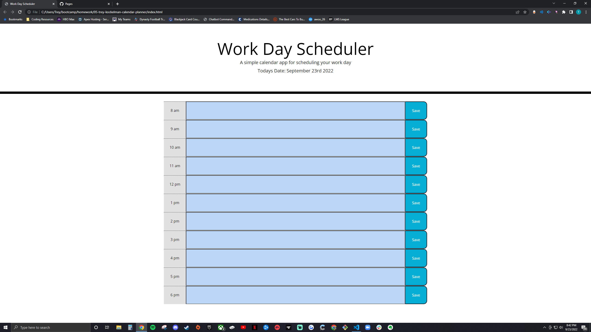

# 05 Trey Kockelman Calendar Planner

## Description

The purpose of this webpage is to give the user a way to track their calendar and input items for the current day. The planner then displays the input items and styles them according to time of the day once saved by the user.

## Installation

NA

## Usage

The use of this page is to generate a quiz for coding purpose about me and coding.

## Credits

NA

## License

NA

## Link

https://treykockelman.github.io/04-trey-kockelman-code-quiz/

## Screenshot

